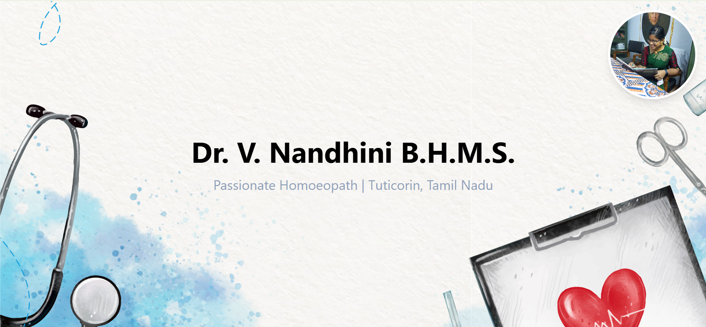

Got it 👍 Here’s a clean **README.md** draft tailored for your **Homoeopath Doctor Portfolio Application**


# 👩‍⚕️ Dr. Nandhini – Homoeopath Doctor Portfolio

A personal portfolio web application for **Dr. Nandhini**, showcasing her expertise, services, achievements, and contact details. Built with **React + TailwindCSS** for a responsive and modern user experience.

---

## 🚀 Features

* 🖼️ **Profile Section** – Display doctor’s picture and introduction
* 📖 **About Section** – Background, qualifications, and specializations
* 🧑‍🤝‍🧑 **Services** – Treatments and areas of expertise in Homoeopathy
* 🏆 **Achievements & Experience** – Years of practice, certifications, and recognitions
* 📞 **Contact Section** – Easy access to appointment booking or inquiries

---

## 🛠️ Tech Stack

* **React** (Frontend)
* **Tailwind CSS** (Styling)
* **Vite / CRA** (Build tool, depending on your setup)
* **GitHub Pages / Vercel / Netlify** (For deployment – choose your preferred)

---

## 📂 Project Setup

Clone the repo:

```bash
git clone https://github.com/aravinthraj42/doctor-portfolio.git
cd doctor-portfolio
```

Install dependencies:

```bash
npm install
```

Run locally:

```bash
npm run dev
```

Build for production:

```bash
npm run build
```

---

## 📸 Screenshots

*Add screenshots of the app once UI is ready.*



---

## 🌐 Deployment

The application can be deployed to:

* **GitHub Pages**
* **Netlify**
* **Vercel**

(Instructions will be added once deployed)

---

## 🤝 Contributing

This is a personal project. Suggestions and improvements are welcome via issues or pull requests.

---

## 📧 Contact

**Dr. Nandhini**
📍 Location: \[Tuticorin, Tamil Nadu]
📩 Email: \[nandhinikiwi@gmail.com]
📞 Phone: \[+91-XXXXXXXXXX]

---

